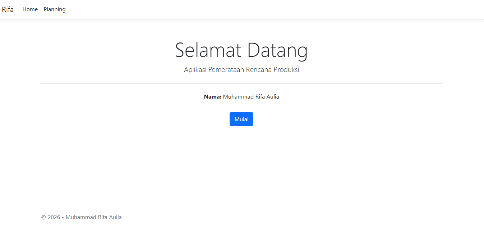
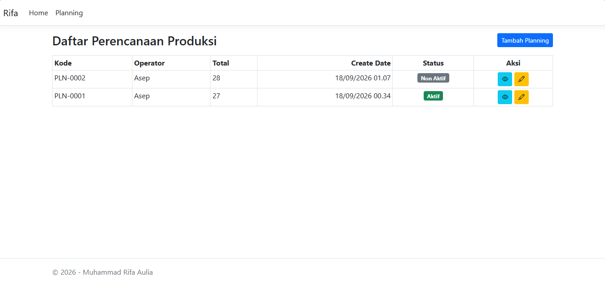
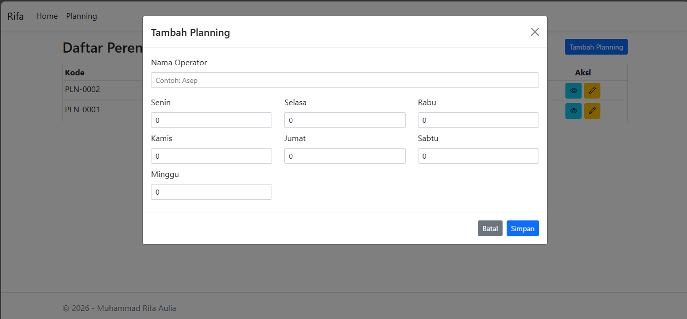
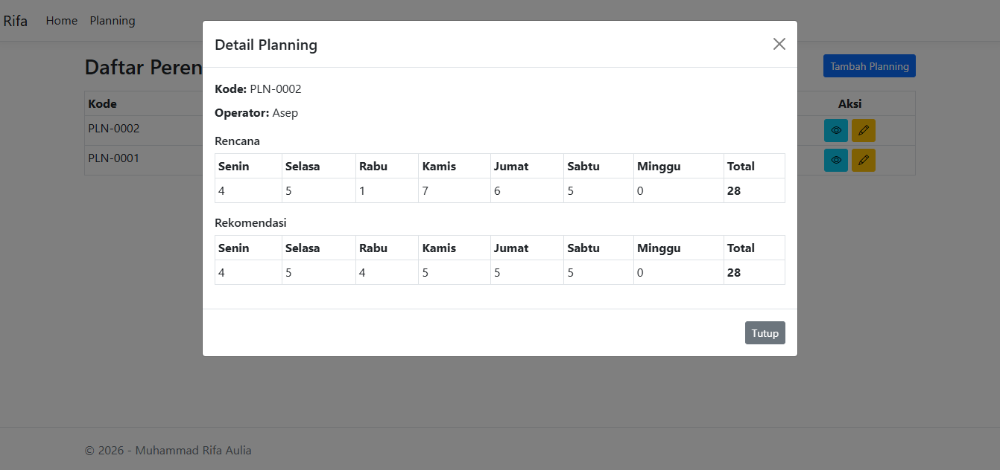
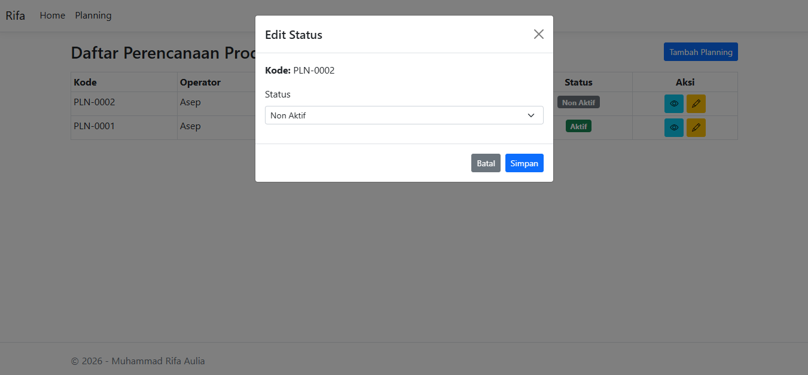
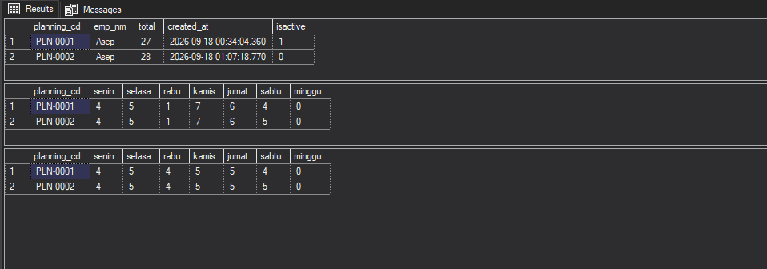

# AGIT - Aplikasi Pemerataan Rencana Produksi

Aplikasi web berbasis ASP.NET Core MVC untuk meratakan rencana produksi mobil selama 7 hari (Senin–Minggu), tanpa mengubah total produksi.

## Fitur

- Input rencana produksi 7 hari
- Pemerataan otomatis
- Status aktif/nonaktif planning
- Simpan data ke SQL Server
- Tampilan detail rencana vs rekomendasi

## Teknologi

- ASP.NET Core MVC (.NET 8)
- Entity Framework Core 8
- SQL Server
- Bootstrap 5
- Bootstrap Icons

## Struktur Database

Database: `RIFADB`

Tabel:
- `tmst_planning` — data header planning
- `tplanning_user` — data rencana input user
- `tplanning_recommendation` — data hasil rekomendasi

Sequence: `seqplanning` — untuk generate kode planning otomatis (`PLN-0001`, `PLN-0002`, dst)

## Setup Database

1. Buka **SQL Server Management Studio (SSMS)**
2. Jalankan script di file [`database.sql`](database.sql) untuk membuat:
   - Database `RIFADB`
   - Sequence `seqplanning`
   - Tabel `tmst_planning`, `tplanning_user`, `tplanning_recommendation`
3. Sesuaikan connection string di `appsettings.json`

## Cara Menjalankan

1. Clone repository ini
2. Buka `Rifa.sln` di Visual Studio 2022
3. Setup database (lihat bagian "Setup Database" di atas)
4. Sesuaikan connection string di `appsettings.json`
5. Tekan **F5** untuk menjalankan aplikasi

## Aturan Pemerataan

1. Jumlahkan semua input → total produksi
2. Hitung jumlah hari kerja (nilai > 0)
3. Total ÷ jumlah hari kerja = rata-rata dasar + sisa
4. Semua hari kerja diberi rata-rata dasar
5. Sisa dibagikan +1 ke hari kerja dengan rencana awal terbesar
6. Kalau nilai sama, prioritaskan hari yang lebih awal

## Contoh

Input: `4, 5, 1, 7, 6, 4, 0` (total 27, 6 hari kerja)

| Hari | Rencana | Rekomendasi |
|------|---------|-------------|
| Senin | 4 | 4 |
| Selasa | 5 | 5 |
| Rabu | 1 | 4 |
| Kamis | 7 | 5 |
| Jumat | 6 | 5 |
| Sabtu | 4 | 4 |
| Minggu | 0 | 0 |
| **Total** | **27** | **27** |

## Screenshot

### Halaman Home

### Halaman Planning

### Modal Tambah Planning

### Modal Detail

### Modal Edit Status

### Database

## Author

**Muhammad Rifa Aulia**
